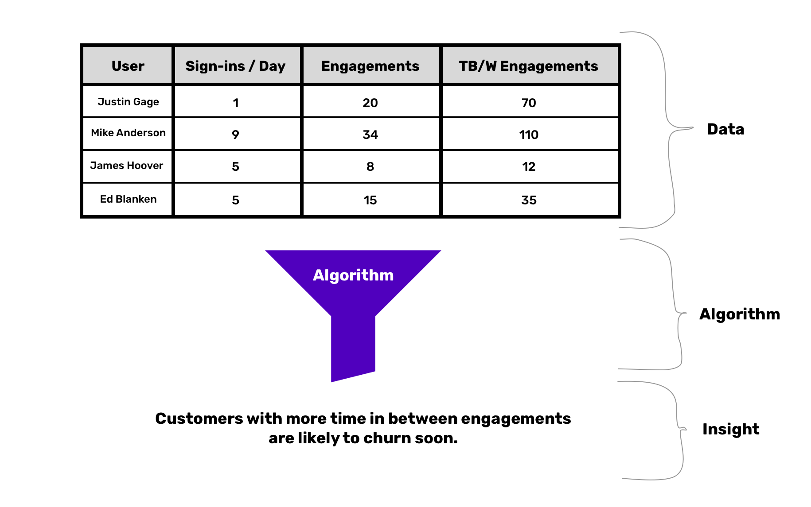
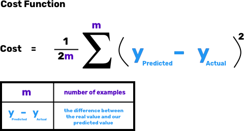
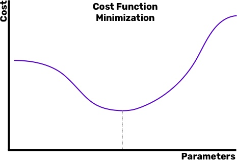

# Введение в машинное обучение

*Перевод статьи из блога [Algorithmia](https://algorithmia.com/): [Introduction to Machine Learning](https://blog.algorithmia.com/introduction-to-machine-learning/)*


Машинное обучение - о том, как делать предсказания. В данной статье будет дано введение в машинное обучение через проблему, с которой сталкивается большинство коммерческих предприятий: прогнозирование оттока клиентов. ML способно предсказать, кто из ваших клиентов рискует уйти, и дать вам возможность предпринять все необходимые действия дабы не допустить этого.

## Введение

Машинное обучение лучше всего понимать, взглянув на него с различных углов.

- Широкий: машинное обучение - это процесс предсказания, обычно основанный на прошлом.
- Практический: машинное обучение пытается найти взаимосвязи в данных, чтобы помочь предсказать, что будет дальше.
- Технический: машинное обучение использует статистические методы для прогнозирования значения целевой переменной с использованием набора входных данных.
- Математический: машинное обучение пытается предсказать значение переменной Y с учетом ввода набора X.

Машинное обучение позволяет точно прогнозировать, используя простые статистические методы, алгоритмы и современные вычислительные мощности.

*Пример оттока:* машинное обучение поможет нам понять, почему клиенты уйдут и когда. Наши входные значения могут включать:

- Как часто пользователи взаимодействуют с продуктом
- Что их удерживает
- Насколько пользователи связаны друг с другом

Мы предполагаем, что эти данные скажут что-то важное о клиенте.

## Данные / Алгоритм

Любой тип машинного обучения можно разбить на две основные части:

- Данные
- Алгоритм

Любые другие усложнения, которые вы можете услышать - глубокое обучение, градиентный спуск, обучение с подкреплением - это всего лишь вариации этих двух фундаментальных частей. Если вы когда-нибудь запутаетесь во всех этих терминах, просто спросите себя, имеет ли это вообще отношение к вашим данным или вашему алгоритму. Все остальное - шелуха.




**Ваши данные**

Часть о данных в машинном обучении является самой простой. Данные - это все то, что вы пытаетесь предсказать, и как вы планируете обучать компьютер этому.

*Пример оттока:* данными может стать прошлая активность пользователя. Данные обычно организованы в виде строк со столбцами, представляющими их особенности (диаграмма выше).

Методы машинного обучения будут пытаться найти закономерности в этих данных. Мы могли бы найти несколько разных типов отношений:

- Пользователи с большим интервалом между заказами, скорее всего, скоро уйдут
- Пользователи с большим количеством заказов вряд ли будут уходить

В данных может существовать любое количество отношений. Машинам нужны лишь эти данные, они обработают их и выделят отношения.

**Ваш алгоритм**

В машинном обучении алгоритм - это просто метод, который вы будете использовать для поиска связей в ваших данных. Алгоритмы могут быть сложными или простыми, большими или маленькими, но, по сути, это всего лишь способы выяснить, что движет изменениями, которые вы пытаетесь предсказать. Вы слышали о глубоком обучении? Это (в основном) тип алгоритма. Подобно тому, как алгоритм MergeSort эффективен при сортировке массивов, алгоритмы машинного обучения эффективны при выявлении отношений и ассоциаций.

Разные типы алгоритмов помогут вам достичь разных целей. Если вы хотите объяснить отношения в человеческом общении, возможно, стоит воспользоваться таким простым алгоритмом, как линейная регрессия. Если вас больше всего интересует точность (и объяснимость не слишком важна), нейронные сети могут достичь более высоких показателей точности. Это часто называют компромиссом между точностью и объясняемостью, и это серьезный выбор, который приходится делать многим специалистам по данным.

Все остальное, с чем вы сталкиваетесь в мире ML, связано с одним из этих двух: данные или алгоритм. Нормализация свойств? Изменение ваших данных. Глубокое обучение? Тип алгоритма. Перекрестная проверка? Способ улучшить ваш алгоритм. Поверьте, [зуб даю](https://www.urbandictionary.com/define.php?term=take%20it%20to%20the%20bank).

## Как это работает

Верьте или нет, концепции, лежащие в основе машинного обучения, на самом деле очень просты, даже если алгоритмы могут оказаться сложными. Большинство алгоритмов ML используют один метод, чтобы найти отношения, о которых мы говорили, и они буквально нащупывают их вслепую. Технически это называется [градиентным спуском](https://ru.wikipedia.org/wiki/%D0%93%D1%80%D0%B0%D0%B4%D0%B8%D0%B5%D0%BD%D1%82%D0%BD%D1%8B%D0%B9_%D1%81%D0%BF%D1%83%D1%81%D0%BA), но сам метод прост - мы начинаем с некоторой случайной точки и пытаемся улучшить наши прогнозы.

Мы начнем с [функции потерь](https://ru.wikipedia.org/wiki/%D0%A4%D1%83%D0%BD%D0%BA%D1%86%D0%B8%D1%8F_%D0%BF%D0%BE%D1%82%D0%B5%D1%80%D1%8C) - способа оценить, насколько хорошо мы справляемся с поиском отношений. Другими словами, это помогает нам определить, насколько плохи наши прогнозы, чтобы мы могли работать над их улучшением. Функция потерь зависит от того, какой алгоритм вы используете. Для линейной регрессии она представляет собой следующее:



Это может показаться сложным на первый взгляд, но давайте сосредоточимся на функции. Она определяет разницу между тем, что предсказывает алгоритм - `hO(x(i))` - и действительным значением целевой переменной - `y(i)`. Наша цель в минимизации функции потерь, потому что мы хотим, чтобы прогнозируемые значения были как можно ближе к фактическим целевым значениям переменных.

Как же это сделать? Мы начнем со случайного набора предсказаний и постараемся двигаться в сторону улучшения. Если наши прогнозы окажутся слишком высокими, мы подстроимся. Если слишком низкими - мы тоже подстроимся. Алгоритм в основном движется вслепую и медленно, пока не находит то, что ищет. Самое смешное, что градиентный спуск фактически сам по себе является алгоритмом - мы используем алгоритм для улучшения нашего алгоритма. Довольно круто! Для получения более подробной информации о том, как реализован алгоритм градиентного спуска (в дополнение к другим решениям для оптимизации функции потерь), ознакомьтесь с [Введением в оптимизаторы](https://blog.algorithmia.com/introduction-to-optimizers/).



Давайте еще раз сложим все вместе: мы используем градиентный спуск, чтобы оптимизировать нашу функцию потерь, и именно так алгоритм находит основную связь в данных. Мы делаем это, начиная с случайных предсказаний и постепенно калибруя наш подход, пока не подойдем как можно ближе к искомым значениям.

**Обучение с учителем и без**

На практике существует два основных типа машинного обучения, в которых алгоритм и данные связаны по-разному: [обучение с учителем](https://ru.wikipedia.org/wiki/%D0%9E%D0%B1%D1%83%D1%87%D0%B5%D0%BD%D0%B8%D0%B5_%D1%81_%D1%83%D1%87%D0%B8%D1%82%D0%B5%D0%BB%D0%B5%D0%BC) и [обучение без учителя](https://ru.wikipedia.org/wiki/%D0%9E%D0%B1%D1%83%D1%87%D0%B5%D0%BD%D0%B8%D0%B5_%D0%B1%D0%B5%D0%B7_%D1%83%D1%87%D0%B8%D1%82%D0%B5%D0%BB%D1%8F). Различия между ними деликатные, но важные. Основное различие в том, как вы представляете свои данные для алгоритма.

В обучении с учителем вы определяете возможные результаты. В примере с погодой мы можем сказать, что данный день может быть жарким, холодным или умеренным. Затем мы передаем данные в алгоритм, и он выясняет, что (если что-нибудь) приводит к жарким дням, что приводит к холодным дням и что приводит к умеренным дням. Поскольку мы определили варианты - горячие, холодные и умеренные - алгоритм будет выдвигать прогнозы в рамках этой структуры.

Но иногда мы не знаем, какие есть варианты или какими мы хотим их видеть. Обучение без учителя берет данные и пытается выяснить, каковы различные потенциальные группировки. Алгоритм обучения без учителя может обнаружить, что группы с наиболее отчетливыми особенностями - это очень жаркие, умеренные и облачные дни. Вместо того, чтобы заранее определять группы результатов и пытаться сопоставить с ними отношения, мы позволяем алгоритму найти те, которые он считает наиболее органичными.

По сути, разница между этими двумя типами машинного обучения заключается в модели ввода-вывода. В обучении с учителем вы предоставляете алгоритму X и Y и пытаетесь выяснить отношения между ними. В обучении без учителя нет Y - вы просто пытаетесь понять основную организацию данных самих по себе.

## Машинное обучение на практике

На практике элементарное машинное обучение легко получить. Существуют наборы инструментов на любой вкус: от людей, никогда раньше не писавших ни строчки кода, до специалистов по машинному обучению, стремящихся идеально оптимизировать каждый параметр.

**Инструменты**

Некоторые инструменты позволяют запускать машинное обучение для набора данных без написания кода. Если вы эксперт в конкретной области знаний и не имеете какого-либо опыта программирования, эти инструменты помогут вам [привнести ML в ваши задумки](https://blog.algorithmia.com/deploying-machine-learning-at-scale/):

- [Dataiku DSS](https://www.dataiku.com/)
- [Pienso](http://pienso.com/)
- [Google AutoML](https://cloud.google.com/automl/)
- [Amazon Sagemaker](https://aws.amazon.com/sagemaker/)

**Популярные фреймворки / Пакеты**

Фреймворки объединяют основные функции на определенном языке программирования во что-то более простое в использовании и мощное. Практически, вместо того, чтобы писать математику и статистику выбранного вами алгоритма вручную (*однако некоторые люди предпочитают это!*), вы можете просто реализовать его на своем любимом языке программирования.

На самом деле, используя популярный фреймворк [scikit-learn](http://scikit-learn.org/stable/index.html) на Python, мы можем быстро обучить [метод опорных векторов](https://ru.wikipedia.org/wiki/%D0%9C%D0%B5%D1%82%D0%BE%D0%B4_%D0%BE%D0%BF%D0%BE%D1%80%D0%BD%D1%8B%D1%85_%D0%B2%D0%B5%D0%BA%D1%82%D0%BE%D1%80%D0%BE%D0%B2) (тип алгоритма).

```py
#Import the support vector machine module from the sklearn framework

from sklearn import svm

#Label x and y variables from our dataset

x = ourData.features

y = ourData.labels

#Initialize our algorithm

classifier = svm.SVC()

#Fit model to our data

classifier.fit(x,y)
```

Scikit-learn - один из многих пакетов, используемых разработчиками для облегчения работы с машинным обучением и повышения его эффективности. Но есть и другие не менее популярные:

- TensorFlow
- Caffe (для глубокого обучения)
- MLlib (для больших данные)
- Torch (прежде всего GPU)

**Онлайн курсы и видео**

К счастью, в 2018 году появилось несколько отличных онлайн-ресурсов, которые помогут вам быстро освоиться с машинным обучением.

- [Курс Andrew Ng на Coursera](https://www.coursera.org/learn/machine-learning) является стандарт де-факто и отлично справляется с объяснением математики и теории традиционного машинного обучения.
- Для более практичного подхода, основанного на коде, попробуйте [Руководство по машинному обучению](https://machinelearningmastery.com/machine-learning-in-python-step-by-step/)
- Для глубокого обучения, [курс от fast.ai](http://www.fast.ai/)

## Книги

[Практическое машинное обучение с Scikit-Learn и Tensorflow](http://shop.oreilly.com/product/0636920052289.do) (O’Reilly) - «Благодаря серии последних достижений глубокое обучение расширило всю область машинного обучения. Теперь даже программисты, которые почти ничего не знают об этой технологии, могут использовать простые эффективные инструменты для реализации программ, способных учиться на данных. Эта практическая книга покажет вам как».

[Машинное обучение в реальном мире](https://www.manning.com/books/real-world-machine-learning) (Мэннинг) - «Машинное обучение в реальном мире - это практическое руководство, предназначенное для обучения работающих разработчиков искусству создания ML. Без передозировки академической теорией и сложной математики она знакомит с повседневной практикой машинного обучения, подготавливая вас к успешному созданию и внедрению мощных систем ML».

[Программируя коллективный интеллект](https://www.amazon.com/Programming-Collective-Intelligence-Building-Applications/dp/0596529325/ref=sr_1_1?s=books&ie=UTF8&qid=1519171418&sr=1-1&keywords=programming+collective+intelligence) (O’Reilly) - «Хотите использовать всю мощь поисковых рейтингов, рекомендаций по продуктам, социальных закладок и онлайн-знакомств? Эта увлекательная книга демонстрирует, как вы можете создавать приложения web 2.0 для извлечения огромного количества данных, созданных людьми в интернете. С помощью сложных алгоритмов, описанных в этой книге, вы cможете создавать интеллектуальные программы для доступа к интересным наборам данных с других веб-сайтов и сбора данных от пользователей ваших собственных приложений».

[Введение в статистическое обучение](https://www.amazon.com/Introduction-Statistical-Learning-Applications-Statistics/dp/1461471370/ref=sr_1_1_sspa?ie=UTF8&qid=1519171390&sr=8-1-spons&keywords=The+Elements+of+Statistical+Learning&psc=1) - «Введение в статистическое обучение предоставляет доступный обзор области статистического обучения, необходимый набор инструментов для понимания обширных и сложных наборов данных, появившихся в различных областях в последние двадцать лет: от биологии к финансам, от маркетинга к астрофизике. В этой книге представлены некоторые из наиболее важных методов моделирования и прогнозирования, а также соответствующие приложения».

## Руководства

[Ваш первый проект машинного обучения на Python, шаг за шагом](https://machinelearningmastery.com/machine-learning-in-python-step-by-step/) (Jason Brownlee) - «Хотите заниматься машинным обучением с использованием Python, но сложно уже в самом начале? В этом посте вы сделаете свой первый проект машинного обучения с использованием Python. Если вы новичок в машинном обучении и хотите наконец начать использовать Python, это руководство было разработано специально для вас».

[Машинное обучение на Python: руководство по Scikit-Learn](https://www.datacamp.com/community/tutorials/machine-learning-python) (Datacamp) - «Машинное обучение - это отрасль компьютерных наук, которая изучает проектирование алгоритмов, способных к обучению. Типичными задачами являются формирование понятий, прогнозирование, кластеризация и поиск моделей прогнозирования. Эти задачи реализуются на основе имеющихся данных, полученных в ходе наблюдения, эксперимента или инструкций».

[Машинное обучение на Python: руководство](https://www.dataquest.io/blog/machine-learning-python/) (Dataquest) - «В этом учебном руководстве мы познакомим вас с основными принципами машинного обучения и с тем, как начать использовать машинное обучение с Python. К счастью для нас, в Python есть удивительная экосистема библиотек, с которой легко начать работать с машинным обучением. В этом руководстве мы будем использовать отличные библиотеки Scikit-learn, Pandas и Matplotlib».

[Машинное обучение на R для начинающих](https://www.datacamp.com/community/tutorials/machine-learning-in-r) (Datacamp) - «Это небольшое руководство призвано познакомить вас с основами машинного обучения на R: оно покажет вам, как использовать R для работы с хорошо известным алгоритмом машинного обучения под названием «KNN» или метод k-ближайших соседей».

---

*Подписывайтесь, лайкайте, хлопайте, репостите! **Это действительно важно, спасибо 🙌🏻** Канал: [maria_machine](https://t.me/maria_machine). Чат: [maria_machine_chat](https://t.me/maria_machine_chat). Twitter: [mariamachine_ml](https://twitter.com/mariamachine_ml). VK: [maria_machine](https://vk.com/maria_machine). FB: [maria.machine.ml](https://www.facebook.com/maria.machine.ml). Github: [maria-machine](https://github.com/maria-machine).*