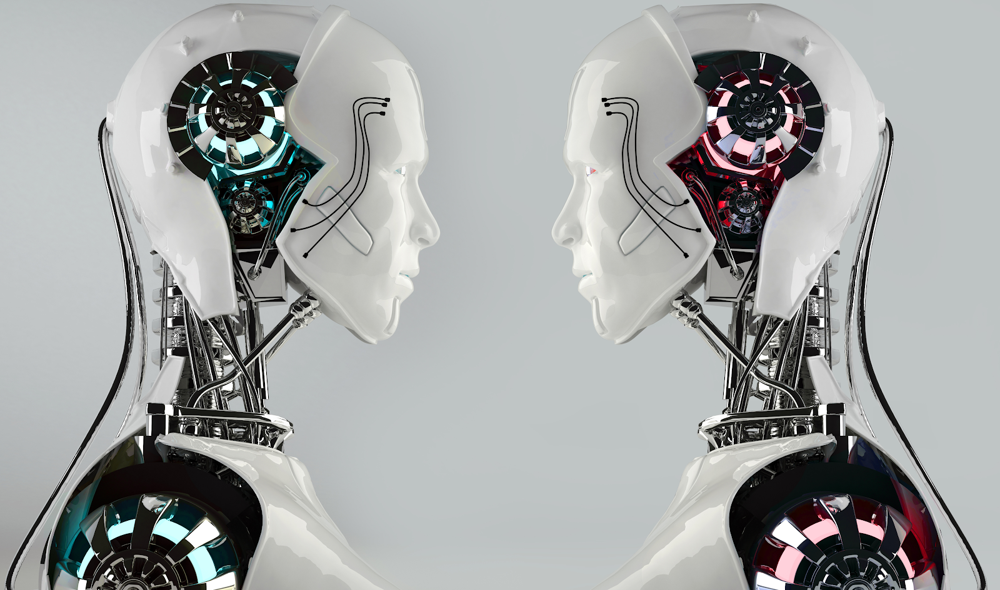
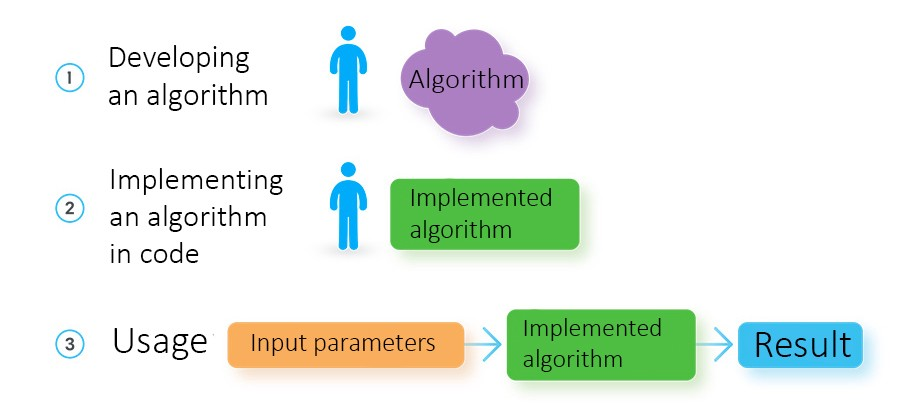
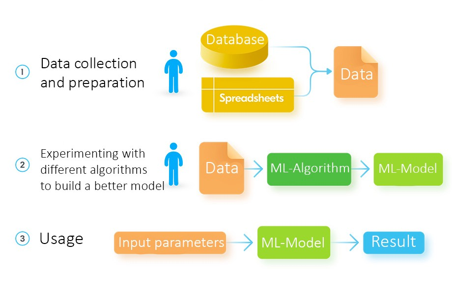
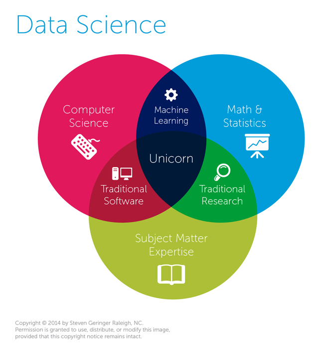

# Машинное обучение против традиционного программирования

*Перевод статьи [Oleksii Kharkovyna](https://www.instagram.com/miallez/): [Machine Learning vs Traditional Programming](https://towardsdatascience.com/machine-learning-vs-traditional-programming-c066e39b5b17)*

Некоторые называют AI и ML переоцененными, не являющимися ничем большим в сравнении с традиционным программированием. Я же предлагаю вам взглянуть фактам в лицо дабы самим проверить это. В данной статье я сопоставлю различные термины, а также продемонстрирую разницу между специалистами: инженер-программист, разработчик программного обеспечения, специалист по машинному обучению, специалист по данным... некоторые люди также используют термины программер или кодер, а некоторые даже достигают уровня ниндзя, гуру или рок-звезды! Но так ли они тождественны? И если все-таки да, какова грань между машинным обучением и традиционным программированием?

## Машинное обучение против программирования: что такое машинное обучение?

Легко сказать, что AI и ML - не что иное, как условные конструкции или даже просто статистика. Что еще мы постоянно слышим о них? ML - всего лишь новое слово, чтобы описать математику + алгоритмы? Иногда такие упрощения смешат, но, очевидно, что ML куда сложнее.

Давайте посмотрим на более подходящее объяснение.

Простыми словами, **искусственный интеллект** - это зонтик, содержащий другие сферы, такие как обработка изображений, когнитивная наука, нейронные сети и многое другое. Машинное обучение также является компонентом, расположенным под этим зонтиком. Его основная идея заключается в том, что компьютер не просто использует заранее написанный алгоритм, но и учится решать проблему самостоятельно. Или, чтобы объяснить это другими словами, есть прекрасное определение [Артура Самуэля](https://ru.wikipedia.org/wiki/%D0%A1%D1%8D%D0%BC%D1%8E%D1%8D%D0%BB,_%D0%90%D1%80%D1%82%D1%83%D1%80) (который фактически ввел термин ML):

> Машинное обучение - это область знаний, дающая компьютерам возможность учиться без явного программирования.

Так что, да, ML позволяет машине решать различные задачи, которые трудно решить алгоритмически. Что это за задачи? Вы наверняка уже натыкались на них в практике. Например, это может быть распознавание лица или голоса вашим телефоном, вождение автомобиля (Google Self-Driving Car), диагностика заболеваний по симптомам (Watson), рекомендация продуктов, книг (Amazon), фильмов (Netflix), музыки (Spotify), выполнение функции личного помощника (Сири, Кортана)... этот список можно продолжать бесконечно.

Хорошо, надеюсь, что это было достаточно ясно, и теперь настало время перейти к другому важному вопросу о машинном обучении.

Любую работающую ML-технологию можно условно отнести к одному из трех уровней доступности. Что это означает? Первый уровень - это когда технология доступна исключительно крупным технологическим гигантам, таким как Google или IBM. Второй уровень - когда студент с определенными знаниями может ее использовать. И последний, третий уровень доступности ML - когда справится даже бабушка.

Текущий уровень развития ML - стык второго и третьего уровней. Благодаря этому темп изменения мира с помощью этой технологии растет с космической скоростью.

Последнее, но не самое важное в ML: большинство задач по машинному обучению можно разделить на **обучение с учителем** и **обучение без учителя**. И если вы представляете программиста с кнутом в одной руке и кусочком сахара в другой, вы немного ошибаетесь. Понятие «учитель» означает идею вмешательства человека в обработку данных. При обучении с учителем, у нас есть данные, и нам нужно что-то прогнозировать на их основе. С другой стороны, при обучении без учителя, у нас снова есть данные, но здесь нам нужно найти их свойства.

## Машинное обучение против программирования: чем ML отличается от программирования?

> В традиционном программировании вы жестко задаете поведение программы. В машинном обучении вы многое оставляете машине для обучения на основе данных.

Следовательно, эти термины не являются взаимозаменяемыми: специалист по данным не может заменить работу традиционного программиста и наоборот. Хотя каждый специалист по данным обязан использовать хотя бы один язык программирования, традиционное программирование - это лишь малая часть того, что он делает. С другой стороны, мы не можем сказать, что разработчик программного обеспечения применяет какие-либо ML-алгоритмы в ходе создания веб-сайта.

ML, как и AI, - это не замена, а дополнение к традиционным подходам разработки. Например, ML можно использовать при разработке прогнозирующих алгоритмов для интернет-магазина, в то время как пользовательский интерфейс, визуализация данных и другие его элементы будут разрабатываться на общепринятых для этого языках программирования, таких как Ruby или Java.

Итак, главное: ML используется в том случае, когда традиционные подходы разработки отстают и или их недостаточно для полной реализации определенной задачи.

Что это значит на практике? Вот отличное объяснение на основе классической ML-проблемы прогнозирования обменного курса и двух возможных способов реализации:

**Традиционный подход разработки**

Для любого решения прежде всего требуется создание наиболее подходящего алгоритма и написание кода. После этого необходимо предоставить входные параметры и, если реализованный алгоритм в порядке, вы получите ожидаемый результат.

Однако, когда нам нужен элемент предсказания, мы вынуждены использовать алгоритм с разнообразными входными параметрами. В случае прогнозирования обменного курса необходимо добавить такие детали, как вчерашний курс, внешние и внутренние экономические изменения в стране-эммитенте и многое другое.

Следовательно, мы разрабатываем решение, способное принимать набор параметров и прогнозировать новый обменный курс. Но важно понимать, что нам придется добавить *сотни тысяч* параметров, так как их ограниченный набор позволит построить лишь очень простую и немасштабируемую модель. Ни один человек не сможет работать с такими огромными массивами данных.

**Тогда на сцену и выходит подход машинного обучения**

Чтобы решить ту же проблему, используя ML-методы, специалисты по данным используют совершенно другую процедуру. Вместо того, чтобы разрабатывать алгоритм самостоятельно, им нужно собрать массив исторических данных, которые будут использоваться для полуавтоматического построения модели.

Располагая удовлетворительным набором данных, специалист по данным загружает их в уже адаптированные ML-алгоритмы. Результат - модель, предсказывающая новый результат, получая обновленные входные параметры.

Отличительная черта ML заключается в том, что нет необходимости строить модель. Эту сложную и ответственную задачу берут на себя ML-алгоритмы, а специалист в области машинного обучения только корректирует процесс.

Другое существенное различие между машинным обучением и программированием определяется количеством входных параметров, которые модель способна обработать. Для точного прогноза вы должны добавить тысячи параметров и сделать это с очень высокой точностью, поскольку каждый бит будет влиять на конечный результат. Человек априори не может построить алгоритм, который сможет адекватно работать с такой сложностью.

Однако для ML таких ограничений нет. Пока у вас достаточно мощности процессора и памяти, вы можете использовать столько входных параметров, сколько считаете нужным. Несомненно, этот факт делает машинное обучение такой мощной и широко распространенной технологией на текущий момент.

## Подводя итог: специалист по машинному обучению, специалист по данным, программист и инженер-программист... кто есть кто?

> Согласно Wiki, [наука о данных](https://en.wikipedia.org/wiki/Data_science) - это междисциплинарная область, которая использует научные методы, процессы, алгоритмы и системы для извлечения знаний и идей из структурированных и неструктурированных данных.

Пока звучит не очень заманчиво. Но дальше есть кое-то интересное:

> использует самые мощные аппаратные средства, самые мощные системы программирования и самые эффективные алгоритмы для решения проблем.

И самая интересная часть:

> В 2012 году Harvard Business Review назвал науку о данных «Самой привлекательной работой 21 века».

Итак, наука о данных - это еще один обширный зонтик, как и информатика, только наука о данных направлена на обработку данных и извлечения из них полезной информации.

Как насчет программирования? В настоящее время специалисты по данным программируют исключительно в интересах исследований. Они также должны знать прикладную статистику или иметь опыт ее исследования. Некоторые также занимаются разработкой программного обеспечения, особенно в компаниях, обслуживающих науку о данных / машинное обучение в своих продуктах. Самое интересное, что специалист по данным не обязан уметь хорошо программировать, а может ограничиться рядом инструментов, например Matlab, SPSS, SAS и так далее.

**Каково же место инженера по машинному обучению?**

Должность инженера по машинному обучению более «техническая». Другими словами, такой инженер имеет больше общего с классической разработкой программного обеспечения, чем с наукой о данных. При этом стандартные задачи инженера по машинному обучению, как правило, аналогичны специалисту по данным. Вам также необходимо уметь работать с данными, экспериментировать с различными алгоритмами машинного обучения, которые помогут решить проблему, создавать прототипы и готовые решения.

Из ключевых отличий я бы выделил:

- Сильные навыки программирования на одном или нескольких языках (обычно Python)
- Меньше внимания уделяется умению работать в средах анализа данных, но больше внимания уделяется алгоритмам машинного обучения
- Навык использования готовых библиотек для разных стеков, например, NumPy / SciPy
- Навык создания распределенных приложений, используя Hadoop и других подобных инструментов

А теперь давайте вернемся к программированию и рассмотрим, какие задачи возложены на программиста.

На самом деле, программист - это кто-то вроде аналитика данных или разработчика бизнес-систем. Программистам не нужно создавать системы самим, они просто пишут свободно структурированный код для существующих систем. И, да, мы можем назвать науку о данных новой волной программирования, но кодирование - лишь малая часть профессии, не заблуждайтесь.

Но если копнуть глубже, мы обнаружим, что есть и другие термины, такие как инженер-программист и разработчик программного обеспечения, и оба они также не похожи. Например, инженер-программисты должны проектировать. Они занимаются боевыми приложениями, распределенными системами, параллелизмом, системами сборки, микросервисами. А разработчик программного обеспечения должен понимать все циклы разработки программного обеспечения, а не только его реализацию (которая иногда даже не требует программирования).

Итак, программирование и машинное обучение... чувствуете ли вы разницу сейчас? Я надеюсь, что этот пост помог вам избежать путаницы с этими терминами. Несомненно, у всех них есть общее - технология, но число их различий гораздо больше. Таким образом, ML-инженер, инженер-программист и разработчик программного обеспечения совершенно не взаимозаменяемы.

---

*Подписывайтесь, лайкайте, хлопайте, репостите! **Это действительно важно, спасибо 🙌🏻** Канал: [maria_machine](https://t.me/maria_machine). Чат: [maria_machine_chat](https://t.me/maria_machine_chat). Twitter: [mariamachine_ml](https://twitter.com/mariamachine_ml). VK: [maria_machine](https://vk.com/maria_machine). FB: [maria.machine.ml](https://www.facebook.com/maria.machine.ml). Github: [maria-machine](https://github.com/maria-machine).*